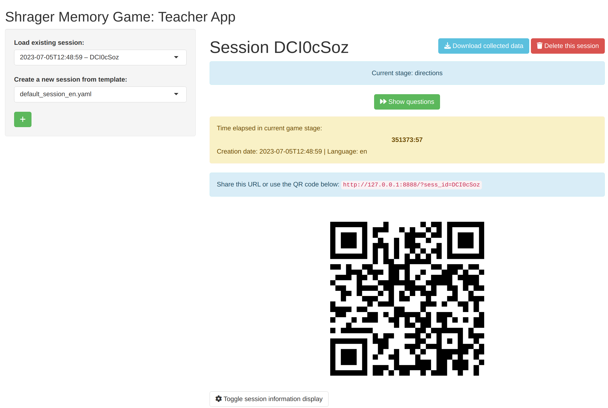

# Shiny apps for Shrager Memory Game in-class experiments

Date: March 2024

Author: Markus Konrad <[markus.konrad\@htw-berlin.de](mailto:markus.konrad@htw-berlin.de)>

## Overview

This repository contains code for two R Shiny apps to conduct an in-class experiment suggested by Adam Shrager, 2009.

The experiment has the aim to show how to perform hypothesis testing and lets the students generate their own data for that.

## Local installation

There are two RStudio projects with the Shiny apps: `MGParticipant` contains the code for the memory game (the participants' app) and `MGTeacher` contains the code for the experiment management interface (the teachers' app). Both projects employ [renv](https://rstudio.github.io/renv/) for dependency management. To install all required packages, open the respective RStudio projects, install the `renv` package (if not already installed) and then run `renv::restore()`.

## Running the apps locally

1. Create the file `MGTeacher/.Renviron` with the only content `PARTICIPANT_APP_BASEURL=http://127.0.0.1:8888/`.
2. Open the `MGParticipant` app and run it on a fixed port 8888 via `shiny::runApp(port = 8888, launch.browser = FALSE)`.
3. Open the `MGTeacher` app and run it on any other port using the "Run app" button or via `shiny::runApp()`.
4. Create a new experiment by clicking on the green "+" button in the MGTeacher app. An URL with an unique experiment session ID like `http://127.0.0.1:8888/?sess_id=XYZ` will be created which can be shared among participants. Open the link with a browser on the same machine (as the apps only run locally on your machine, the URL will *not* work in your smartphone or any other machine – you will need to deploy the apps on a server as described below).
5. A message like "Please wait. The game hasn't started yet." should appear in the browser window that shows the participant's view. Using the MGTeacher app, you can advance to the next stages of the game (*"Show directions"*, etc.) and the participant's view will be updated accordingly.

## Deployment / installation on a server

To run this app on a server, the server needs to have a [Shiny server](https://docs.posit.co/shiny-server/) (open-source or professionall variant) installed and configured. Then, do the following:

1. Create the base folder that will contain the shiny apps. We will call this folder `MemoryGame`. This folder must be a sub-folder of the folder that is configured to serve Shiny apps (e.g. `~/ShinyApps/MemoryGame`).
2. Copy the folders `MGParticipant`, `MGTeacher` as well as the file `common.R` to the `MemoryGame` folder on the server. Make sure to **exclude the `renv` subfolder from copying but do include the `renv.lock` file!**
3. Install all necessary dependencies for the MGParticipant and the MGTeacher app by installing the `renv` package and then running `renv::activate()` and `renv::restore()`.
4. Create an empty folder `MemoryGame/sessions`. This folder must be writable by the Shiny server instance.
5. Create the file `MemoryGame/MGTeacher/.Renviron` with the only content `PARTICIPANT_APP_BASEURL=<URL_TO_PARTICIPANT_APP>`; replace `<URL_TO_PARTICIPANT_APP>` by the actual URL that will point to the MGParticipant app on the server, e.g. `https://example-shiny-server.com/MemoryGame/MGParticipant/`.
6. **Protect access to the MGTeacher app**, e.g. by password protection (that can be employed by a HTTP proxy server that routes all requests to the Shiny apps or by using the professional variant of the Shiny server).
7. Navigate to the MGTeacher app in your browser (e.g. `https://example-shiny-server.com/MemoryGame/MGTeacher/`) and create a new experiment; open the URL that was created for the experiment and check if everything works.

## Using the apps

### Creating a new experiment (before class starts)

1. Before the lecture starts, open the teacher app: https://example-shiny-server.com/MemoryGame/MGTeacher/ . Log in with the user name and password specified before.
2. On the top left, below "Create a new ession from template:" select "default_session_en.yaml" (or default_session_de.yaml for a German version). Then click on "+" to initialise a new game.
3. You should now see "Current stage: start" at the top right.
4. Scroll down a little to the QR code, zoom in if necessary. The students will enter the game via this QR code, or alternatively via the link above it
5. We recommend to leave the browser window with the QR code open while starting the lecture and introducing the experiment
(If anything goes wrong, initialize a new session before as described above)

### Running the experiment (during class)

1. Say a few introductory words, like "We are going to generate data together that we will analyze afterwards... This is a memory game... It is completely anonymous, only you can see how many points you have scored."(Do not mention the intervention here, as it would spoil the effect)
- Now show the QR code on the website above, ask students to join with their smartphone. (Some may have to come to the front with their smartphone and take a photo of the code up close.)
- The students can now see "Please wait, the game has not started yet"
- help people having trouble scanning the code
- When the students have joined, click on on the website to display the instructions on the smartphones.
- Say something like "Please read the instructions on your phone now". Important: Do not explain anything else here so that the intervention can "take effect". Wait 1-2 minutes until everyone has read.
- Now read out the following sentences. Take a short break after each sentence and visualize what has been said so that the visualization group also has enough time to visualize. Ask students who are taking notes not to do so.

## File and code structure

The main code is divided into two Shiny apps, each an RStudio project: *MGTeacher* is the administration interface that allows to create new experiments as can be seen in this screenshot:

Once an experiment is created, it can be shared with students via a QR-code which leads to an URL that opens the *MGParticipant* app, which contains all code for the memory game.

The file `common.R` contains R code used in both apps. The `sessions` folder contains data for all experiments that were created. Each experiment gets an unique session ID and when creating an experiment, a folder with that session ID will be created inside the `sessions` folder.

Finally, there's the `UserDataAnalysis` folder which contains an RStudio project with scripts to prepare and analyse the data from the experiments.
